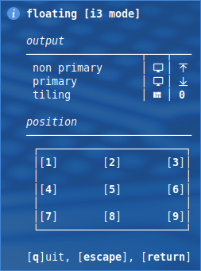
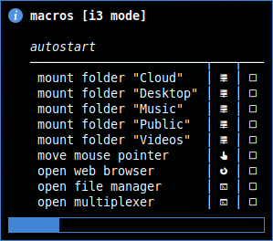
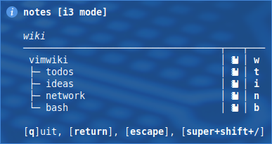

# i3

shell scripts for i3

| file                 | comment                                                      |
| :------------------- | :----------------------------------------------------------- |
| i3_autotiling.sh     | automatic optimal tilings for windows                        |
| i3_container.sh      | shows keybindings for i3 container actions                   |
| i3_editor.sh         | shows keybindings for editor                                 |
| i3_exit.sh           | shows keybindings for lock, reboot, shutdown, etc.           |
| i3_floating.sh       | shows keybindings for positioning floating windows           |
| i3_helper.sh         | used in the other scripts for table, notify, net check, etc. |
| i3_macros.sh         | shows keybindings for predefined macros                      |
| i3_mouse_move.sh     | move mouse pointer to the edge of the monitor                |
| i3_nfs.sh            | shows keybindings for nfs mounts                             |
| i3_notes.sh          | shows keybindings for notes                                  |
| i3_services.sh       | shows keybindings for services                               |
| i3_ssh.sh            | shows keybindings for ssh connections                        |
| i3_tmux.sh           | open applications in tmux windows                            |
| i3_window_move.sh    | move floating window to the edge of the monitor              |
| i3_workspace_swap.sh | swap workspaces and focus(left,right,up,down)                |
| suspend@.service     | systemd service to lock the screen before sleep              |

config files:

- [dotfiles/i3](https://github.com/mrdotx/dotfiles/tree/master/.config/i3)
- [dotfiles/polybar](https://github.com/mrdotx/dotfiles/tree/master/.config/polybar)
- [dotfiles/tmux](https://github.com/mrdotx/dotfiles/tree/master/.config/tmux)
- [dotfiles/dunst](https://github.com/mrdotx/dotfiles/tree/master/.config/dunst)
- [dotfiles/systemd](https://github.com/mrdotx/dotfiles/tree/master/.config/systemd/user)

related projects:

- [polybar](https://github.com/mrdotx/polybar)

# suspend systemd service

service to lock the screen before sleep

## installation

- cp suspend@.service /etc/systemd/system/suspend@.service

## enable service

- systemctl enable suspend@[username]

## check after reboot

- systemctl status suspend@[username]

