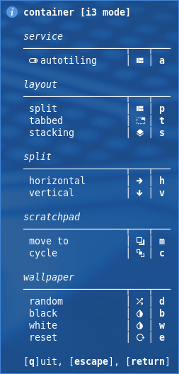
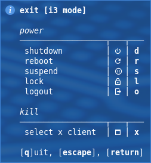
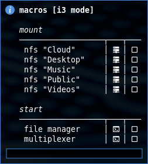
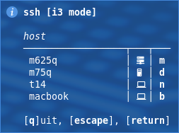

# i3

shell scripts for i3

| folder  | comment                       |
| :------ | :---------------------------- |
| images  | images for the README.md file |
| systemd | systemd services and timer    |

| file                 | comment                                                      | image                                                                              |
| :------------------- | :----------------------------------------------------------- | :--------------------------------------------------------------------------------- |
| _i3_helper.sh        | used in the other scripts for table, notify, net check, etc. |                                                                                    |
| _i3_lock.sh          | used in systemd lock service and exit script                 |                                                                                    |
| i3_autotiling.sh     | optimal tiling of focused windows                            |                                                                                    |
| i3_container.sh      | shows keybindings for i3 container actions                   |                                             |
| i3_editor.sh         | shows keybindings for editor                                 |                                                   |
| i3_exit.sh           | shows keybindings for lock, reboot, shutdown, etc.           |                                                       |
| i3_floating.sh       | shows keybindings for positioning floating windows           |                                               |
| i3_macros.sh         | shows keybindings for predefined macros                      |   |
| i3_mouse_move.sh     | move mouse pointer to the edge of the monitor                |                                                                                    |
| i3_nfs.sh            | shows keybindings for nfs mounts                             |                                                         |
| i3_services.sh       | shows keybindings for services                               |                                               |
| i3_ssh.sh            | shows keybindings for ssh connections                        |                                                         |
| i3_tmux.sh           | open applications in tmux windows                            |                                                                                    |
| i3_window_move.sh    | move floating window to the edge of the monitor              |                                                                                    |
| i3_workspace_swap.sh | swap workspaces and focus(left,right,up,down)                |                                                                                    |

config files:

- [dotfiles/i3](https://github.com/mrdotx/dotfiles/tree/master/.config/i3)
- [dotfiles/polybar](https://github.com/mrdotx/dotfiles/tree/master/.config/polybar)
- [dotfiles/tmux](https://github.com/mrdotx/dotfiles/tree/master/.config/tmux)
- [dotfiles/dunst](https://github.com/mrdotx/dotfiles/tree/master/.config/dunst)
- [dotfiles/systemd](https://github.com/mrdotx/dotfiles/tree/master/.config/systemd/user)

related projects:

- [polybar](https://github.com/mrdotx/polybar)
