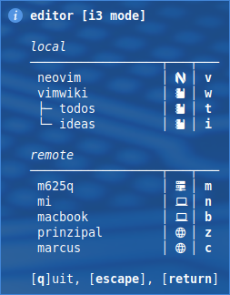
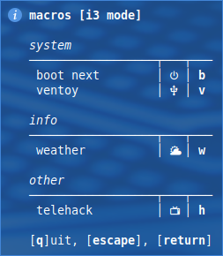

# i3

shell scripts for i3

| name                 | comment                                                |
| :------------------- | :----------------------------------------------------- |
| i3_alsa.sh           | control volume                                         |
| i3_autotiling.sh     | optimal tilings for focused window                     |
| i3_backlight.sh      | change backlight brightness                            |
| i3_container.sh      | shows keybindings for container mode with notify-send  |
| i3_editor.sh         | shows keybindings for editor mode with notify-send     |
| i3_exit.sh           | lock/suspend/logout/reboot/shutdown/switch user script |
| i3_macros.sh         | shows keybindings for predefined macros                |
| i3_services.sh       | shows keybindings for services mode with notify-send   |
| i3_ssh.sh            | shows keybindings for ssh mode with notify-send        |
| i3_tmux.sh           | open applications in tmux windows                      |
| i3_workspace_swap.sh | swap workspaces and focus(left,right,up,down)          |

config files:

- [dotfiles/i3](https://github.com/mrdotx/dotfiles/tree/master/.config/i3)
- [dotfiles/polybar](https://github.com/mrdotx/dotfiles/tree/master/.config/polybar)
- [dotfiles/tmux](https://github.com/mrdotx/dotfiles/tree/master/.config/tmux)

related projects:

- [polybar](https://github.com/mrdotx/polybar)
